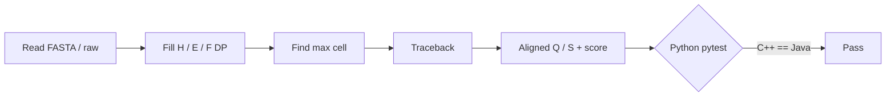

# alignx

**Smith–Waterman local sequence alignment** — a compact computational-biology / algorithms portfolio piece with a **C++17** engine, a **Java** reference implementation (same CLI/output contract), and **Python** tests that assert bit-for-bit agreement on fixtures.

> Author: **Sumit Kumar Ta (SK090347)** · Dual license **MIT OR Apache-2.0**

---

## Why Smith–Waterman?

Global alignment (Needleman–Wunsch) forces end-to-end paths. **Local** alignment finds the highest-scoring contiguous pair of subsequences — the right model for shared domains, motifs, and noisy flanks. Classic dynamic programming; time and space **O(mn)** for sequences of lengths *m* and *n*.

### DP recurrence

Let \(s(a_i,b_j)\) be the substitution score (match / mismatch). With a **linear** gap penalty \(g > 0\):

\[
H_{i,j} = \max\begin{cases}
0 \\
H_{i-1,j-1} + s(a_i,b_j) \\
H_{i-1,j} - g \\
H_{i,j-1} - g
\end{cases}
\]

With **affine** gaps (Gotoh-style open \(o\) and extend \(e\)):

\[
\begin{aligned}
E_{i,j} &= \max(H_{i,j-1} - o - e,\ E_{i,j-1} - e) \\
F_{i,j} &= \max(H_{i-1,j} - o - e,\ F_{i-1,j} - e) \\
H_{i,j} &= \max(0,\ H_{i-1,j-1} + s(a_i,b_j),\ E_{i,j},\ F_{i,j})
\end{aligned}
\]

Traceback from \(\arg\max H\) until a zero cell; complexity remains **O(mn)** time and **O(mn)** memory (matrices + pointers).



---

## Layout

| Path | Role |
|------|------|
| `cpp/` | C++17 library + CLI (`alignx`) — CMake |
| `java/` | Java reference (`com.alignx`) — `javac` or Maven |
| `python/` | CLI harness + **pytest** cross-checks |
| `fixtures/` | FASTA-ish sample pairs |
| `.github/workflows/ci.yml` | Build all three languages + tests |

---

## Quick start

```bash
# C++ + Java
make cpp
make java

# Cross-engine tests (needs pytest)
python3 -m venv .venv && source .venv/bin/activate
pip install -e "./python[dev]"
pytest python/tests -v

# Side-by-side demo
make demo
```

### CLI (identical flags on C++ and Java)

```bash
./cpp/build/alignx --affine --match 2 --mismatch -1 --gap-open 2 --gap-extend 1 \
  fixtures/query.fa fixtures/subject.fa

java -cp java/out com.alignx.Main --affine fixtures/query.fa fixtures/subject.fa

# Or via Python
python -m alignx.cli --engine both fixtures/query.fa fixtures/subject.fa
```

Machine-readable output (used by tests):

```
SCORE=...
Q=...
S=...
START_Q=...
START_S=...
END_Q=...
END_S=...
MODE=affine|linear
```

Raw sequences are accepted as arguments; paths are treated as **FASTA-ish** (headers `>` / `;` skipped, whitespace stripped).

---

## Use cases

- Teaching local alignment / Gotoh affine gaps alongside Needleman–Wunsch
- Validating a high-performance C++ core against a transparent Java reference
- Portfolio demonstration of DP, multi-language tooling, and CI hygiene
- Seed for motif search or domain-spotting prototypes (not a BLAST replacement)

---

## Build notes

- **C++**: CMake ≥ 3.16, C++17 (`cmake -S cpp -B cpp/build && cmake --build cpp/build`)
- **Java**: JDK 17+ (`make java` → `java/out`), optional `java/pom.xml`
- **Python**: 3.10+, pytest for the comparison suite

---

## License

Dual **MIT OR Apache-2.0** — see `LICENSE`, `LICENSE-MIT`, `LICENSE-APACHE`, and `NOTICE`.

## Topics

`bioinformatics` · `smith-waterman` · `cpp` · `java` · `python` · `dynamic-programming` · `portfolio`
